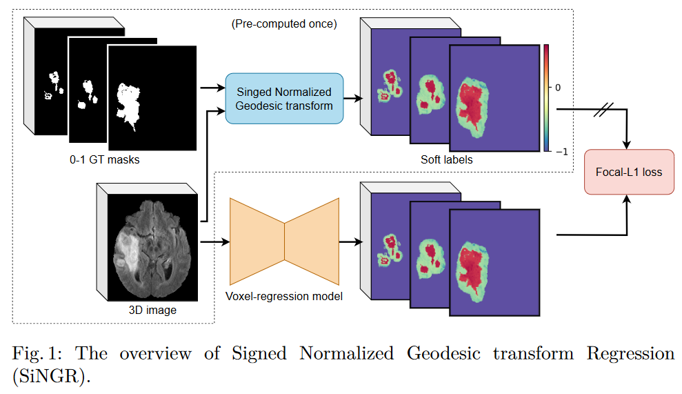

# <a href=https://arxiv.org/pdf/2405.16813>SiNGR</a>
**SiNGR: Brain Tumor Segmentation via Signed Normalized Geodesic Transform Regression**

Accepted as a paper conference at **MICCAI 2024**

Arxiv: <a href=https://arxiv.org/pdf/2405.16813>Link</a>


## Dependencies

We provide file `env.yaml` for dependencies. If generating the Geodesic files is needed, use `pip install -r requirements_geo.txt`.

Alternatively, it is possible to use fast implementation of Geodesic: `pip install FastGeodis`.

## Installation

```bash
conda env create -f env.yaml
conda activate singr
pip install -e .
```

## Split data
```bash
cd mlpipeline/utils
python split_brats.py
python split_lggflair.py
```

## Applying SiNG transform
```bash
cd mlpipeline/utils
python geodesic_transform.py --label_name "fast_sgc_margin" \
      --dataset ${DATASET} \
      --root_dir ${ROOT_DIr} \
      --gt_dir ${GT_DIR} \
      --output_dir ${OUTPUT_DIR}
```

## Training
```bash
python -m mlpipeline.train.run experiment=${EXP_NAME} \        
        model.params.cfg.arch=${ARCH_NAME}
```
where
- <EXP_NAME>: experiment setting can be `brats_uncertainty_sem_seg`, `brats_sem_seg`, `lgg_uncertainty_sem_seg`, or `lgg_sem_seg`.
- <ARCH_NAME>: architecture name can be `EoFormer`, `Unet3D`, `UnetPP3D`, `SegResNet`, `UNETR`, `SwinUNETR`, `TransBTS`, or `NestedFormer`.

## Evaluation
```bash
python -m mlpipeline.train.evaluate \
    --config=${EXP_NAME} \
    --output_dir=/path/to/inference_results/${EXP_NAME} \
    --log_dir=/path/to/eval/${EXP_NAME} \
    --visual_dir=/path/to/visuals \
    --metadata_path=/path/to/test_split.pkl \
    --dataset_name=${DATASET} \
    --seeds=${SEEDS} \
    --folds=0
```
where
- DATASET: is either `brats` or `lgg`.


